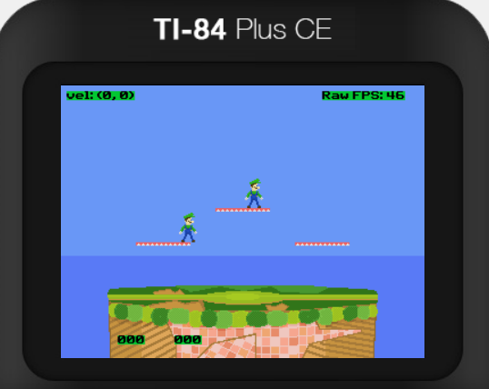
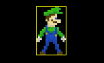
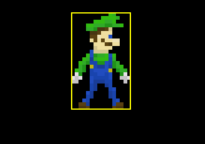

### smashce

Super smash brothers for the ti 84 + ce

## Features
* luigi
  * neutral attack
  * neutral, side, and up aerial
  * side, up, and down b
* physics
  * ground collision
  * platform collision
  * ground and air movement
    * friction
    * air resistance
    * gravity
* controls
  * supports up to 2 xbox 360 controllers plugged into mini usb port
  * alternatively supports one player controlled by calculator keypad
    * plans to support link cable style play
* animation system
  * data based (see (animations.c)[src/animations.c])
    * but can also run custom procedures
  * can have different hurtboxes per frame

 

## build & run

(install the cedev toolchain)[https://github.com/CE-Programming/toolchain/releases]

1. generate graphics files with `make gfx`
2. build release or debug
  * for release (normal), build with `make`
  * if you want to see hitboxes or access the animation debug menu (accessible with `0`), then build with `make debug`
  * if you switch between these, make sure to `make clean` in between
3. transfer the file to your calculator or to an emulator like (CEmu)[https://ce-programming.github.io/CEmu/]
  * some calculators need to be jailbroken
  * if you don't have them, you will need to install the clibs (app will explain)
